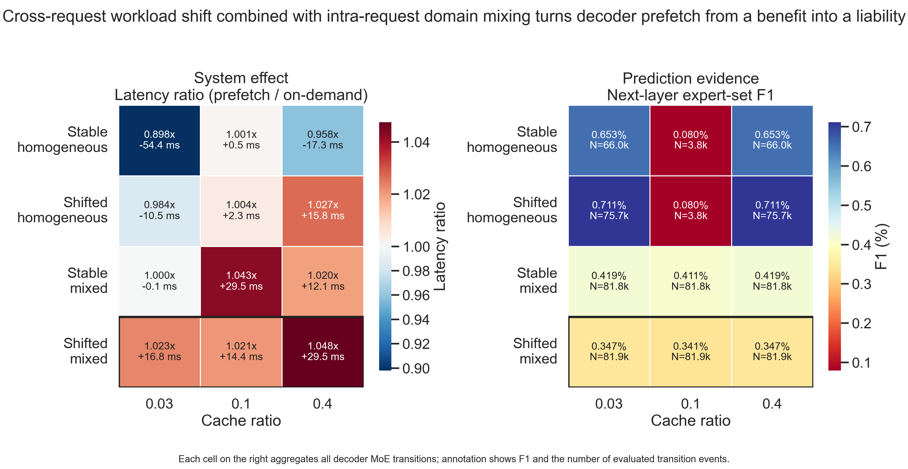

# Decoder Prefetch 在 Workload Shift 与 Cross-Domain Mixing 下的实验总结

一句话概括：在 `switch-base-64` 上，decoder prefetch 只在稳定、单域的请求流中表现出明确收益；一旦同时引入 `cross-request workload shift` 与 `intra-request cross-domain mixing`，预取的下一层 expert 预测质量下降，端到端延迟也稳定劣化，表现为从收益项转化为负担项。

## 1. 实验配置

### 1.1 实验目标

本轮实验的目标是验证如下判断：

> 当请求流同时满足 `cross-request workload shift` 与 `intra-request cross-domain mixing` 时，当前实现中的 decoder prefetch 策略会失效。

这里的“失效”采用双重标准：

- 系统层：`prefetch` 相比 `on-demand` 不再降低延迟，甚至变慢。
- 预测层：当前层对下一层 expert 集合的预测质量下降。

### 1.2 模型与实现范围

- 模型：`switch-base-64`
- 推理路径：`T5-MoE decoder`
- 注意：本项目当前真正接上 prefetch 的是 **decoder MoE 路径**，因此本轮分析仅针对 decoder，不对 encoder prefetch 做结论。

### 1.3 对比方法

- `on_demand`
- `prefetch`

系统层结果以 `prefetch / on-demand` 延迟比表示：

- `< 1.0`：prefetch 有收益
- `= 1.0`：与 on-demand 持平
- `> 1.0`：prefetch 反而拖慢

### 1.4 Workload 条件

实验包含四种 workload：

- `stable_homogeneous`：请求流稳定，单请求单域
- `shifted_homogeneous`：请求流发生跨请求 workload shift，但单请求仍是单域
- `stable_mixed`：请求流稳定，但单请求内部混合多个域
- `shifted_mixed`：同时存在跨请求 shift 与单请求混域

其中：

- `shift_block_size = 32`
- `num_requests = 128`
- 混合域采用 `translation` 与 `summarization`
- `mix_mode = interleave`
- `mix_word_budget = 256`
- `mixed_primary_fraction = 0.5`
- `interleave_chunk_words = 16`

### 1.5 推理与缓存配置

- `batch_size = 1`
- `beam_width = 1`
- `max_seq_len = 128`
- `moe_topk = 1`
- `data_type = fp32`
- `tensor_para_size = 1`
- `pipeline_para_size = 1`
- `cache_policy = LFU`
- `seed = 0`

缓存比例取三档：

- `cache_ratio = 0.03`
- `cache_ratio = 0.1`
- `cache_ratio = 0.4`

### 1.6 预测质量度量

预测层指标使用“下一层 expert-set F1”：

- 预测集合：当前 decoder MoE transition 为下一层预取的 expert 集合
- 实际集合：下一层实际被 routing 命中的 expert 集合
- 聚合方式：对所有 decoder MoE transitions 聚合

图中右侧每个格子的 `N` 表示该实验单元所包含的 transition event 数量，用于说明样本规模。

## 2. 得到的数据

下图是本轮实验的主图。左图展示系统层结果，右图展示对应的预测层证据。

图中信息的读取方式如下：

- 左图：
  - 颜色越蓝，说明 `prefetch` 越有利
  - 颜色越红，说明 `prefetch` 越有害
  - 每个格子同时标注了延迟比和相对 `on-demand` 的毫秒差值
- 右图：
  - 数值是聚合后的 next-layer expert-set `F1`
  - `N` 是该单元包含的 decoder transition event 数量
  - 数值越大，说明下一层 expert 集合越可预测

从图中可以直接读出几组关键数据：

- `Stable homogeneous`
  - `0.03`: `0.898x`, `-54.4 ms`, `F1 = 0.653%`, `N = 66.0k`
  - `0.4`: `0.958x`, `-17.3 ms`, `F1 = 0.653%`, `N = 66.0k`
- `Stable mixed`
  - `0.03`: `1.000x`, `-0.1 ms`, `F1 = 0.419%`, `N = 81.8k`
  - `0.4`: `1.020x`, `+12.1 ms`, `F1 = 0.419%`, `N = 81.8k`
- `Shifted mixed`
  - `0.03`: `1.023x`, `+16.8 ms`, `F1 = 0.347%`, `N = 81.9k`
  - `0.1`: `1.021x`, `+14.4 ms`, `F1 = 0.341%`, `N = 81.9k`
  - `0.4`: `1.048x`, `+29.5 ms`, `F1 = 0.347%`, `N = 81.9k`

说明：

- `Stable homogeneous @ 0.1` 与 `Shifted homogeneous @ 0.1` 的样本量仅约 `3.8k` transitions，明显低于其他格子的 `66k-82k`，因此该列应谨慎解释。
- 但 `Shifted mixed` 一行三个格子的样本量始终充足，因此主结论不依赖少量样本。

## 3. 观察到的现象

### 3.1 稳定单域时，prefetch 仍有收益

在 `Stable homogeneous` 下，`prefetch` 在 `cache_ratio = 0.03` 和 `0.4` 分别达到 `0.898x` 与 `0.958x` 的延迟比，说明当前实现并不是在所有场景下都失败；当请求模式稳定、且 expert overlap 较可预测时，prefetch 仍能减少端到端延迟。

### 3.2 混域本身就会显著削弱 prefetch 的收益

从 `Stable homogeneous` 到 `Stable mixed`，系统层已经出现明显退化：

- `0.03`：`0.898x -> 1.000x`
- `0.4`：`0.958x -> 1.020x`

同时，预测层 F1 也同步下降：

- `0.03`：`0.653% -> 0.419%`
- `0.4`：`0.653% -> 0.419%`

这说明即使没有跨请求 shift，仅仅在单个请求内部混合不同域，就已经足以破坏当前 prefetch 所依赖的下一层 expert overlap 假设。

### 3.3 “shift + mixing” 是最稳定、最明显的失败模式

最核心的现象出现在 `Shifted mixed`：

- 三个 cache ratio 全部落在 `1.0` 之上
- 即 `prefetch` 在所有设置下都比 `on-demand` 更慢

具体而言：

- `0.03`: `+16.8 ms`
- `0.1`: `+14.4 ms`
- `0.4`: `+29.5 ms`

这意味着该 workload 组合不是“偶尔不赚”，而是已经变成“稳定亏损”。

### 3.4 预测质量的下降与系统退化相一致

`Shifted mixed` 的 expert-set F1 分别为：

- `0.347%`
- `0.341%`
- `0.347%`

而对应的 `Stable mixed` 为：

- `0.419%`
- `0.411%`
- `0.419%`

也就是说，在 mixed 条件下再叠加 cross-request shift 后，聚合 F1 额外下降了约 `17%`。这与左图中的系统退化方向完全一致：预测越差，prefetch 越难在系统层转化为收益。

### 3.5 该现象不是由小样本偶然造成的

`Shifted mixed` 三个实验单元的样本量都约为 `81.9k` transition events。也就是说，图中的系统退化与预测退化并非由单次偶然波动驱动，而是在较大样本上稳定出现。

### 3.6 更大的 cache 并没有把问题“救回来”

如果问题只是“cache 不够大”，那么随着 `cache_ratio` 增大，`Shifted mixed` 理应逐渐回到 break-even 以内。但图中相反：

- `0.03`: `1.023x`
- `0.1`: `1.021x`
- `0.4`: `1.048x`

这说明根因不只是缓存容量不足，而是 workload 改变了 expert overlap 的可预测性，使得错误预取与额外搬运开销持续存在。

## 4. 得到的结论

### 4.1 主结论

本轮实验支持如下结论：

> 对于当前实现的 decoder prefetch 策略，当 `cross-request workload shift` 与 `intra-request cross-domain mixing` 同时存在时，prefetch 会从收益项转化为负担项，表现为下一层 expert 预测质量下降，并最终导致端到端延迟稳定劣化。

### 4.2 更细一点的结论

如果进一步拆解这个结论，可以得到更精确的表述：

- `mixing` 是主要压力源：它首先破坏了 expert overlap 的稳定性
- `shift` 是放大器：它把“混域下已经不稳的 prefetch”进一步推成“稳定负收益”

换句话说：

- 稳定单域：prefetch 还能工作
- 稳定混域：prefetch 基本失去优势
- shift + mixing：prefetch 明确失效

### 4.3 对后续算法设计的启示

这说明当前 prefetch 策略隐含依赖了一个较强前提：

> 当前层观察到的 active experts，能够较稳定地预测下一层将要访问的 experts。

而在跨请求 shift 与单请求混域的组合场景中，这一前提被系统性破坏。因而后续若要提升鲁棒性，方向不应仅限于“增大 cache”，而应考虑：

- 更 shift-aware 的 prefetch 决策
- 更 mix-aware 的 routing pattern 建模
- 在预测不稳定时主动退化为 on-demand

### 4.4 当前结论的边界

本轮实验的结论适用于以下范围：

- `switch-base-64`
- `batch_size = 1`
- `moe_topk = 1`
- decoder prefetch 路径

因此，这份结论已经足够支撑“当前策略在目标 workload 下失效”的判断；但如果需要更强的普适性结论，还应继续补充：

- 更大模型，例如 `switch-large-128`
- 更大 batch
- 将 shift 与 mix order 进一步拆分控制的消融实验

