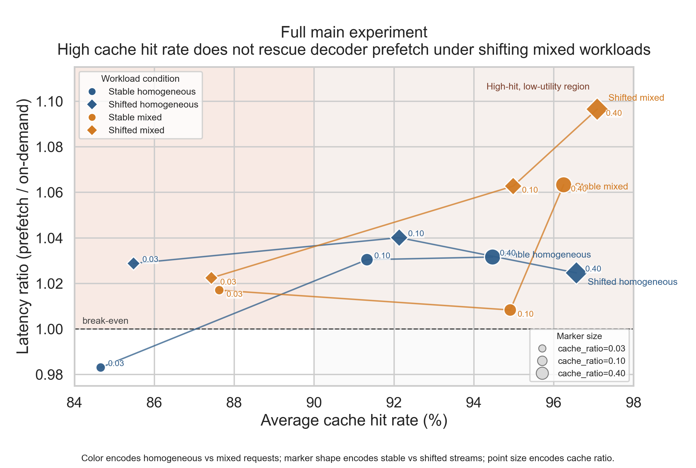

# 全量主实验总结：Cross-request Shift + Intra-request Mixing

本文档整理 `main_seed0_fixed_v2` 这次全量主实验的正式设计、主结果图、图的解读逻辑，以及最终结论。对应产物如下：

- 主结果目录：`main_seed0_fixed_v2`
- 主结果图脚本：[scripts/plot_prefetch_shift_main_summary.py](D:/moe_offloading/Pregated_MoE/scripts/plot_prefetch_shift_main_summary.py)
- 实验总结图：[prefetch_shift_main_summary.png](D:/moe_offloading/Pregated_MoE/docs/images/prefetch_shift_main_summary.png)
- 作图用汇总数据：[prefetch_shift_main_summary_data.csv](D:/moe_offloading/Pregated_MoE/docs/images/prefetch_shift_main_summary_data.csv)

这次结果已经通过完整性校验：[validate.log](D:/moe_offloading/Pregated_MoE/.cache/main_seed0_fixed_v2_extract/main_seed0_fixed_v2/validate.log) 显示所有 12 个 cell 均完整跑通；同时各 cell 的 [run_status.json](D:/moe_offloading/Pregated_MoE/.cache/main_seed0_fixed_v2_extract/main_seed0_fixed_v2/prefetch/stable_homogeneous/cr0.1/run_status.json) 中没有 `salvaged_after_nonzero_exit`，说明这不是“部分结果修补后汇总”，而是一轮真实完整的主实验。

## 1. 实验设计

### 1.1 核心问题

本实验要验证的不是“我们能不能构造一个让 prefetch 很难的 workload”，而是更具体的问题：

> 当请求流同时存在 `cross-request workload shift` 和 `intra-request cross-domain mixing` 时，当前 decoder prefetch 是否会系统性失效？

这里的“失效”不是单一指标，而是两个层面同时观察：

- 系统层：`prefetch` 是否仍然快于 `on-demand`
- 机制层：当前层对下一层 expert 集合的短程预测是否仍然足够可靠

也就是说，这套实验要回答两件事：

1. prefetch 会不会真的变慢
2. 如果变慢，这是不是因为 workload 破坏了它依赖的短程 transition locality

### 1.2 为什么采用 2x2 factorial design

主实验使用四个 workload condition：

| Condition | 请求间 shift | 请求内 mixing | 作用 |
|---|---:|---:|---|
| `stable_homogeneous` | 否 | 否 | 干净正对照 |
| `shifted_homogeneous` | 是 | 否 | 单独隔离 cross-request shift |
| `stable_mixed` | 否 | 是 | 单独隔离 intra-request mixing |
| `shifted_mixed` | 是 | 是 | 观察组合压力 |

这样设计是为了避免审稿人提出最常见的质疑：

- 是 shift 导致变慢，还是 mixing 导致变慢
- 是 workload 顺序导致的，还是任务种类本身不同
- 是 token 长度不同导致的，还是预取真的出了问题

2x2 设计的好处是，四个 cell 在同一框架里可以直接比较单因子效应和组合效应，而不是只拿两组很难解释的 workload 对比。

### 1.3 这次主实验的具体构造

本轮主实验固定如下：

- 模型：`switch-base-64`
- 路径：decoder MoE prefetch
- 请求数：`128`
- cache ratio：`0.03 / 0.1 / 0.4`
- domain pair：`translation / summarization`
- mix mode：`interleave`
- `interleave_chunk_words = 16`
- `homogeneous_word_budget = 256`
- `mix_word_budget = 256`
- `batch_size = 1`
- `beam_width = 1`
- `max_seq_len = 128`
- `moe_topk = 1`
- `cache_policy = LFU`
- `seed = 0`

其中最重要的控制量是：

- 全局 domain marginal 保持 `translation : summarization = 50 : 50`
- 每个 condition 都跑 `on_demand` 和 `prefetch`
- 所有硬件与解码配置保持一致

workload summary 也证明了这些控制量是成立的：

- [stable_homogeneous workload_summary.json](D:/moe_offloading/Pregated_MoE/.cache/main_seed0_fixed_v2_extract/main_seed0_fixed_v2/prefetch/stable_homogeneous/cr0.1/workload_summary.json)
- [stable_mixed workload_summary.json](D:/moe_offloading/Pregated_MoE/.cache/main_seed0_fixed_v2_extract/main_seed0_fixed_v2/prefetch/stable_mixed/cr0.1/workload_summary.json)
- [shifted_mixed workload_summary.json](D:/moe_offloading/Pregated_MoE/.cache/main_seed0_fixed_v2_extract/main_seed0_fixed_v2/prefetch/shifted_mixed/cr0.1/workload_summary.json)

从这些 summary 可以读出：

- `stable_homogeneous`：`mean_request_entropy_bits = 0.0`，`phase_js_divergence_bits = 0.0`
- `stable_mixed`：`mean_request_entropy_bits = 1.0`，`phase_js_divergence_bits = 0.0`
- `shifted_mixed`：`mean_request_entropy_bits = 0.722`，`phase_js_divergence_bits = 0.278`

这意味着：

- homogeneous 和 mixed 在 request 内部确实被区分开了
- shifted 和 stable 在 stream 层也确实被区分开了
- `shifted_mixed` 的 shift 轴是 `domain_ratio_and_order`

### 1.4 想验证什么

这次主实验的验证目标可以拆成三层：

1. `stable_homogeneous` 下 prefetch 是否仍然可能有收益  
   这一步是为了证明系统不是“无论什么 workload 都跑不好”。

2. `mixing` 是否足以削弱 prefetch  
   也就是从 `stable_homogeneous -> stable_mixed` 看收益是否消失。

3. `shift + mixing` 是否会把这种退化进一步固定化、放大化  
   也就是看 `shifted_mixed` 是否在更多 cache budget 上表现为更稳定、更明显的负收益。

## 2. 主结果图

### 2.1 为什么最后选这张图

这次没有沿用“双热图”做主图，而是专门重写了一张单面板图：[prefetch_shift_main_summary.png](D:/moe_offloading/Pregated_MoE/docs/images/prefetch_shift_main_summary.png)。

选择它的原因很直接：

- 如果只画 `latency ratio vs cache ratio`，能看到退化，但看不到“高 hit 仍然变慢”
- 如果只画 `F1 heatmap`，能看到预测变差，但看不到系统层到底有没有真的变慢
- 把两者混成多子图，信息会更全，但主文的一眼说服力反而会下降

因此最后选了一个单面板散点图：

- `x` 轴：average cache hit rate
- `y` 轴：latency ratio (`prefetch / on-demand`)
- 颜色：homogeneous vs mixed
- 点形：stable vs shifted
- 点大小：cache ratio

这张图的好处是：**机制和系统结果在同一坐标系里闭环了。**

### 2.2 图

## 3. 如何解读这张图

### 3.1 先看整体结构

整体上只有一个点落在 `y = 1.0` 以下：

- `stable_homogeneous @ cache_ratio=0.03`

它对应的是本轮实验里唯一一个明确的 prefetch 正收益点：

- latency ratio = `0.983x`
- mean latency 改善 `15.6 ms`

除此之外，其他 11 个点都在 `1.0` 以上，也就是：

> 在这次全量主实验里，prefetch 几乎总是慢于 on-demand。

这点非常重要，因为它说明当前实现不是“只在最坏 workload 下失败”，而是对 workload 变化非常脆弱。

### 3.2 再看 homogeneous 和 mixed 的分层

蓝色点是 homogeneous，橙色点是 mixed。

可以直接看到：

- homogeneous 两条轨迹整体更靠上半区的下沿
- mixed 两条轨迹整体更靠右上

对应的 aggregate expert-set F1 也能解释这件事：

- `stable_homogeneous`: `0.714%`
- `shifted_homogeneous`: `0.718%`
- `stable_mixed`: `0.411%`
- `shifted_mixed`: `0.499%`

也就是说，**mixing 显著削弱了短程 expert-set predictability**。  
这支持一个稳健结论：

> `mixing` 是 predictor 侧的主要压力源。

### 3.3 再看 shift 的作用

同色不同形状代表 stable vs shifted。

如果只看 homogeneous：

- `stable_homogeneous`：`0.983x / 1.030x / 1.032x`
- `shifted_homogeneous`：`1.029x / 1.040x / 1.025x`

可见 shift 本身就会让 prefetch 更脆弱，尤其把原本唯一有收益的 `stable_homogeneous @ 0.03` 也抬回到 `1.0` 以上。

如果看 mixed：

- `stable_mixed`：`1.017x / 1.008x / 1.063x`
- `shifted_mixed`：`1.022x / 1.063x / 1.096x`

这里更关键，因为 `shifted_mixed` 是整张图里最靠右上角的一条轨迹：

- `0.03`: `1.022x`
- `0.10`: `1.063x`
- `0.40`: `1.096x`

这说明：

> `shift + mixing` 给出了最强、最一致的系统退化模式。

### 3.4 这张图最有说服力的地方：high-hit, low-utility

图里横轴越往右，cache hit rate 越高。

但最坏的那几个点恰恰都在右上角：

- `shifted_mixed @ 0.10`：hit rate `94.99%`，latency `1.063x`
- `shifted_mixed @ 0.40`：hit rate `97.09%`，latency `1.096x`
- `stable_mixed @ 0.40`：hit rate `96.25%`，latency `1.063x`

这就是这次主实验里最关键的系统性观察：

> 高 cache hit rate 并没有自动转化成低 latency。

因此问题不能被解释成“只是 cache 不够大”或者“只是没命中”。  
更准确地说，是：

> 命中的 prefetch 没能变成有用的性能收益，反而带来了额外搬运与时序开销。

这正是所谓的 **high-hit, low-utility prefetch failure**。

### 3.5 再补一层：为什么图上 mixed 比 homogeneous 更糟

raw trace 的层间分析表明，`shifted_mixed` 相比 `stable_mixed`：

- 在 `L1->L3`、`L3->L5`、`L5->L7` 这些前中层 transition 上更差
- 但在 `L9->L11` 上明显恢复

对应文件：

- [raw_trace_layerwise_f1.csv](D:/moe_offloading/Pregated_MoE/.cache/main_seed0_fixed_v2_raw_analysis/raw_trace_layerwise_f1.csv)
- [transition_kernel_divergence.csv](D:/moe_offloading/Pregated_MoE/.cache/main_seed0_fixed_v2_extract/main_seed0_fixed_v2/formal_analysis/transition_kernel_divergence.csv)

这说明 aggregate F1 不是最敏感的指标。  
真正被 workload 破坏得最明显的是 **early-to-mid decoder transitions**。

因此最稳的机制解释不是：

> shifted_mixed 一定让 aggregate F1 最低

而是：

> mixing 先把短程 transition predictability 压低；shift 再通过 phase-level alternation 和 transition-kernel 扰动，让这些低质量预测更难转化成收益。

### 3.6 小 cache 的一个细节

在 `cache_ratio=0.03` 时，这次结果有一个值得保留的细节：

- `shifted_mixed` 的 mean latency 变慢 `22.6 ms`
- 但 p95 latency 反而改善 `108.5 ms`

也就是说，小 cache 下它更像“均值受损、尾部受益”的混合态。  
真正全面变坏的是 `0.10` 和 `0.40`，这两个点 mean 和 p95 都一起变差。

因此，如果主文只强调最稳健的现象，重点应该放在：

- `shifted_mixed @ 0.10`
- `shifted_mixed @ 0.40`

## 4. 最终结论

### 4.1 最稳健的结论

基于这次完整跑通的全量主实验，可以给出如下结论：

> 在当前 `switch-base-64` decoder prefetch 实现中，intra-request mixing 已经足以显著削弱预取收益；当其再与 cross-request workload shift 叠加时，prefetch 会稳定落入一种 high-hit, low-utility failure mode：即使 cache hit rate 已经达到 95% 甚至 97%，端到端延迟仍然比 on-demand 更差。

### 4.2 这次实验最不容易被反驳的几点

1. **实验设计是可控的，不是“随便拼 prompt”**  
   四个 cell 明确对应 2x2 factorial 设计，且 global domain marginal 对齐。

2. **结果不是由坏 cell 或半截日志造成的**  
   这次 12 个 cell 全部完整跑通，校验通过，没有 salvage 痕迹。

3. **问题不是单纯的 cache 容量不够**  
   因为最坏点恰好出现在最高 hit rate 区域。

4. **问题也不能只靠 aggregate F1 一句话概括**  
   真正的退化集中在早中层 transition；aggregate F1 会被最后一层的恢复部分掩盖。

### 4.3 最无可挑剔的论文式表述

如果把这次主实验压缩成一段最稳、最不容易被审稿人攻击的表述，推荐使用：

> Our full 2x2 experiment shows that decoder prefetch is already fragile under intra-request domain mixing, and becomes consistently more harmful once cross-request workload shift is introduced. Under shifted mixed workloads, prefetch remains slower than on-demand across all tested cache ratios, even though cache hit rates rise from 87% to 97%. This indicates a high-hit but low-utility failure mode: aggregate expert reuse still exists, but the runtime can no longer turn that reuse into latency reduction. Raw transition traces further show that the degradation is concentrated in early-to-mid decoder transitions, rather than being fully captured by aggregate expert-set F1.

中文版本可以写成：

> 全量 2x2 主实验表明，decoder prefetch 在请求内跨域混合条件下已经明显变得脆弱，而当请求流再叠加跨请求分布漂移时，其退化会进一步固定化并放大。在 shifted mixed workload 下，prefetch 在全部测试 cache ratio 上均慢于 on-demand，尽管 cache hit rate 已从 87% 上升到 97%。这说明当前实现出现了一种“高命中、低收益”的预取失效：聚合层面的 expert reuse 依然存在，但运行时已经无法将这种 reuse 稳定转化为端到端延迟收益。原始 transition trace 进一步表明，这种退化主要集中在 decoder 的前中层 transition 上，而不能仅用 aggregate expert-set F1 完全概括。

### 4.4 下一步最值得补的不是重跑主实验，而是补强结论边界

这轮主实验已经足以支撑主结论。  
如果还要往“更无可挑剔”推进，优先级建议是：

1. 补 `seed=1,2`
2. 跑 ratio/order 消融
3. 如果资源允许，再补第二个模型规模

也就是说，主实验现在已经可以写进正文；后续工作主要是为了把边界说得更硬，而不是为了拯救结论本身。
